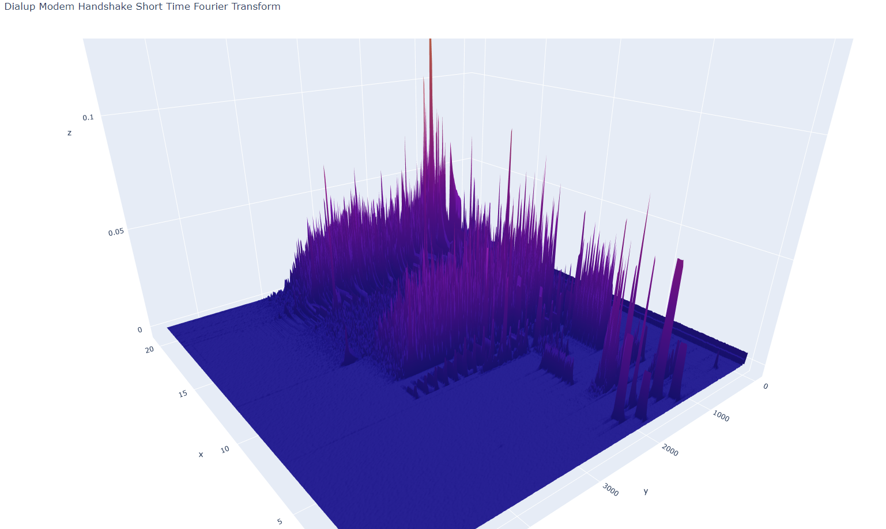

# Fourier Transform Dialup
Weekend project to visualize the fourier transform of the dialup modem handshake sound. Uses short time fourier transform from `scipy` to graph the fourier transform throughout the duration of the sound file.

```
x = Time (s)
y = Frequency (Hz)
```



